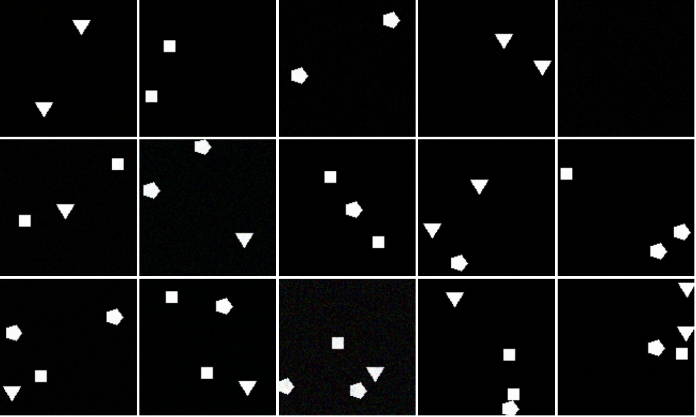
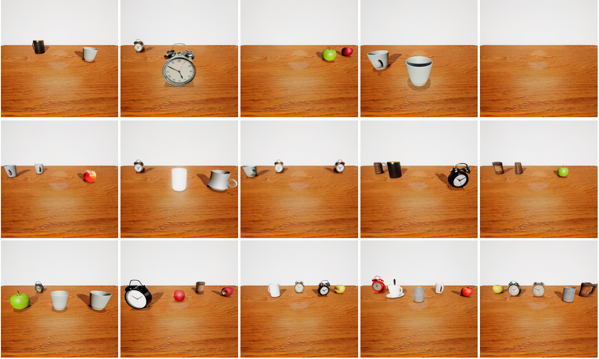
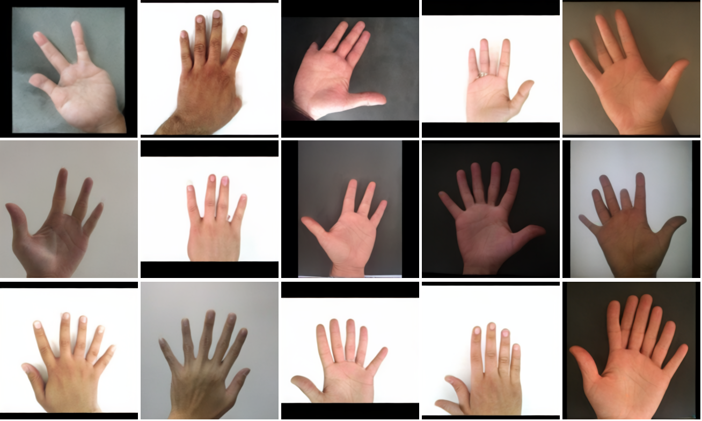
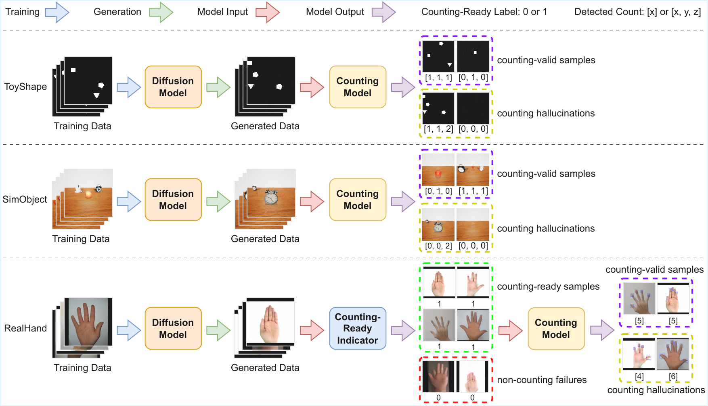
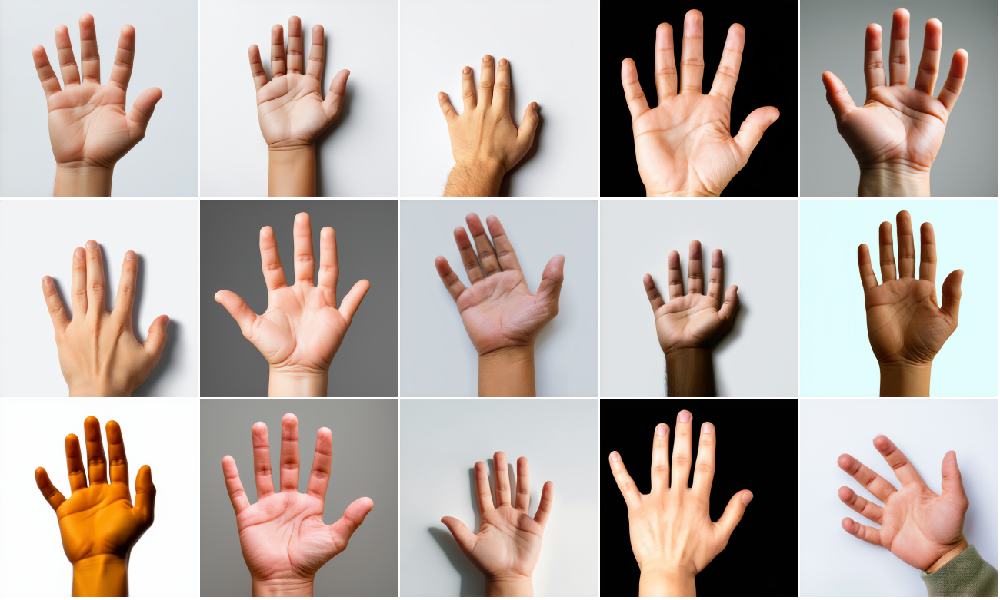
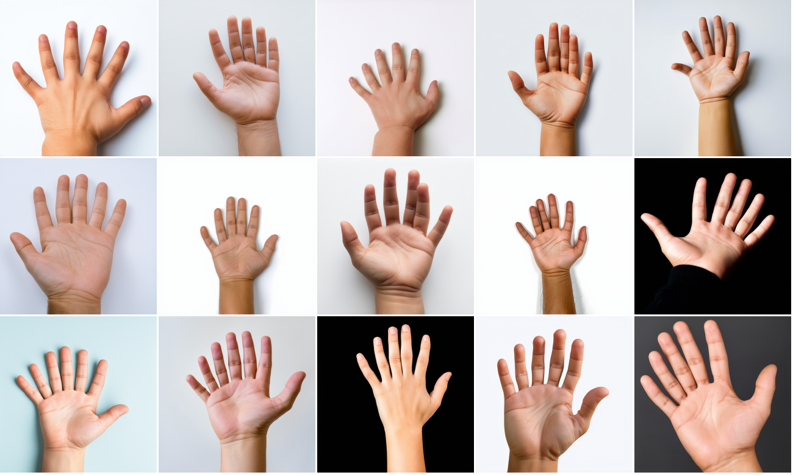
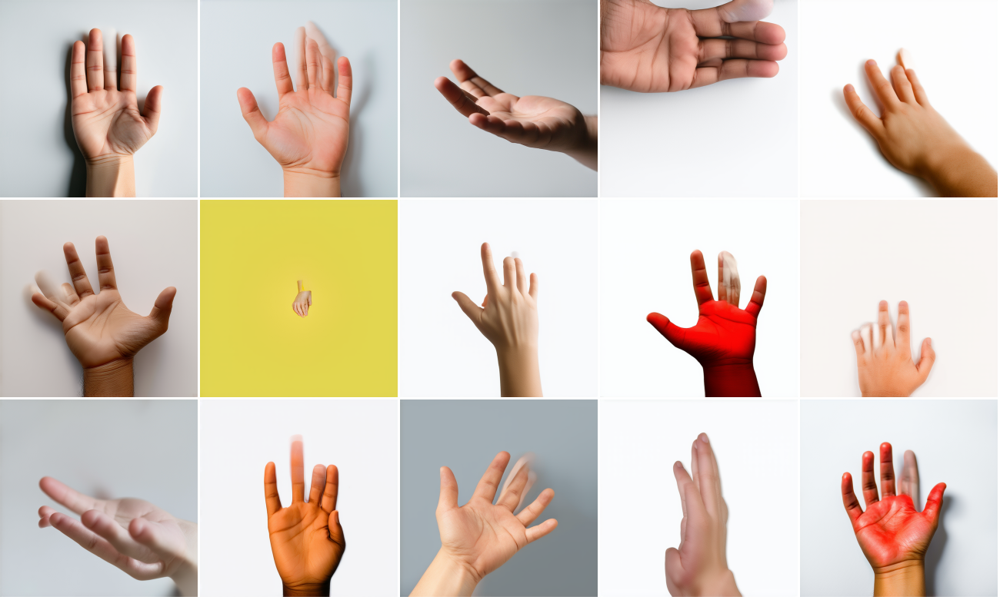

<div align="center">

# Counting Hallucinations in Diffusion Models

[](https://arxiv.org/abs/2510.13080)
[](LICENSE)
[](https://www.python.org/)
[](https://pytorch.org/)

**Shuai Fu, Jian Zhou, Qi Chen, Huang Jing, Huy Anh Nguyen,<br>
Xiaohan Liu, Zhixiong Zeng, Lin Ma, Quanshi Zhang, Qi Wu**

*Official implementation of* **[Counting Hallucinations in Diffusion Models](https://arxiv.org/abs/2510.13080)**

[Paper](https://arxiv.org/abs/2510.13080) ·
[Datasets](#-data-preparation) ·
[Training](#-training) ·
[Evaluation](#-evaluation) ·
[Citation](#-citation)

</div>

---

Diffusion models still generate samples that conflict with real-world
knowledge — a hand with six fingers, a duplicate cup floating beside another —
even when such patterns never appear in the training data. We call this
failure mode **counting hallucination**: generating an incorrect number of
instances or structured objects.

<div align="center">
<table>
  <tr>
    <td align="center"></td>
    <td align="center"></td>
    <td align="center"></td>
  </tr>
  <tr>
    <td align="center"><b>ToyShape</b></td>
    <td align="center"><b>SimObject</b></td>
    <td align="center"><b>RealHand</b></td>
  </tr>
</table>
<p><em>Counting hallucinations generated by diffusion models trained on the three
CountHalluSet datasets: duplicated or missing shapes and objects, and hands with
the wrong number of fingers — none of which exist in the training data.</em></p>
</div>

This repository provides everything needed to *measure* it:

- 🧩 **CountHalluSet**, a dataset suite with well-defined counting criteria:
  **ToyShape**, **SimObject**, and **RealHand**;
- 🏋️ **Training** of unconditional diffusion models (pixel-space DDPM, latent
  diffusion, and joint image+mask diffusion "JDM"), plus a two-stage SD-1.5
  finetuning recipe on real hand photos;
- 📏 A **standardized evaluation protocol** that classifies every generated
  image as counting-correct / counting hallucination / visual failure using
  pretrained counter models, and reports hallucination rates alongside FID,
  Precision / Recall, Inception Score, the diffusion prior gap, and
  per-timestep reconstruction-error curves;
- 🔬 Tools to study how **sampling conditions** — solver type, ODE solver
  order, sampling steps, and initial noise — affect counting hallucinations,
  including "perfect score" samplers driven by the ground-truth data.

<div align="center">
  
  <p><em>The evaluation procedure on CountHalluSet. A counting model checks every
  generated sample against the counting criteria of its dataset; for RealHand, a
  counting-ready indicator first filters out non-counting failures before the
  finger detector counts.</em></p>
</div>

## 📦 Repository layout

```
counthallu/
├── datasets/        # ToyShape / SimObject / RealHand loaders
│   └── toyshape.py  #   also generates the synthetic ToyShape dataset
├── models/
│   ├── unet.py            # UNet presets for unconditional training
│   ├── counting.py        # counter / quality-classifier architectures
│   ├── pipelines.py       # DDPM/LDM pipelines with hallucination-analysis hooks
│   └── t2i_pipelines.py   # SD pipeline with JDM (image+mask) decoding
├── metrics/         # hallucination quantifier, FID, IS, Precision/Recall
├── train/
│   ├── train_uncond.py    # unconditional trainer (ddpm / ldm / jdm)
│   └── train_t2i.py       # SD-1.5 finetuning (full / lora / conv_only)
└── eval/
    ├── eval_uncond.py     # distributed evaluation of unconditional models
    └── eval_t2i.py        # evaluation of finetuned & off-the-shelf t2i models
config/              # train/eval YAMLs + evaluation prompts
scripts/             # train.sh / evaluate.sh launchers
```

## 🔧 Installation

```bash
conda env create -f environment.yaml
conda activate counthallu
pip install -e .
```

Log in once for Hugging Face Hub downloads/uploads and (optionally) Weights & Biases:

```bash
huggingface-cli login
wandb login          # or: export WANDB_MODE=offline
```

## 📁 Data preparation

Download **CountHalluSet** from the Hugging Face Hub:

```bash
export DATASET_ROOT=/path/to/dataset

huggingface-cli download ShyFoo/CountHallu-dataset-ToyShape  --repo-type dataset --local-dir $DATASET_ROOT/ToyShape
huggingface-cli download ShyFoo/CountHallu-dataset-SimObject --repo-type dataset --local-dir $DATASET_ROOT/SimObject
huggingface-cli download ShyFoo/CountHallu-dataset-RealHand  --repo-type dataset --local-dir $DATASET_ROOT/RealHand
```

The evaluation protocol also needs the pretrained counter / quality models:

```bash
export MODELS_ROOT=/path/to/models

huggingface-cli download ShyFoo/CountHallu-counting_model-ToyShape    --local-dir $MODELS_ROOT/counting_model/toyshape
huggingface-cli download ShyFoo/CountHallu-counting_model-SimObject   --local-dir $MODELS_ROOT/counting_model/simobject
huggingface-cli download ShyFoo/CountHallu-counting_model-RealHand    --local-dir $MODELS_ROOT/counting_model/realhand
huggingface-cli download ShyFoo/CountHallu-quality_cls_model-RealHand --local-dir $MODELS_ROOT/quality_cls_model/realhand
```

Each repo ships a single checkpoint named `model.pth`, except the RealHand
counter, which is a YOLO detector and ships `model.pt`. Point `dataset_root`
in the configs at `$DATASET_ROOT` and the `counting_model_path` /
`quality_cls_model_path` entries at the downloaded checkpoints. The expected on-disk layout (see `counthallu/datasets/` for details):

```
$DATASET_ROOT/
├── ToyShape/
│   ├── images/           # 0.png, 1.png, ...
│   └── labels.csv        # filename, triangle, square, pentagon
├── SimObject/            # images/ + labels.csv
└── RealHand/
    ├── images/           # hand photos
    └── masks/            # matching segmentation masks
```

Alternatively, ToyShape can be regenerated from scratch:

```bash
python -m counthallu.datasets.toyshape --data_root $DATASET_ROOT --num_samples 30000
```

Training can also stream datasets directly from the Hub without a local copy —
set `use_hub_dataset: true` and `hub_dataset_id` in the training config
(evaluation still needs the local images as the FID reference set).

## 🚀 Training

Update the paths in the config, then launch (the `num_gpus` field sets the
number of parallel accelerate processes):

```bash
# Unconditional diffusion models
bash scripts/train.sh uncond config/train/toyshape.yaml       # pixel-space DDPM
bash scripts/train.sh uncond config/train/simobject.yaml      # latent diffusion
bash scripts/train.sh uncond config/train/realhand-jdm.yaml   # joint image+mask

# SD-1.5 JDM on hands: a two-stage recipe (80k + 40k = 120k steps in total)
bash scripts/train.sh t2i config/train/sd15-hands.yaml      # stage 1
bash scripts/train.sh t2i config/train/sd15-jdm-hands.yaml  # stage 2
```

The SD-1.5 JDM recipe works as follows:

1. **Stage 1** (`sd15-hands.yaml`): finetune SD-1.5 on RealHand images for 80k
   steps, either fully (`finetune_strategy: full`) or with LoRA adapters
   (`finetune_strategy: lora`).
2. **Stage 2** (`sd15-jdm-hands.yaml`): resume the stage-1 checkpoint — point
   `pretrained_model` at its `final-step-80000` folder, or, if stage 1 used
   LoRA, load the base SD-1.5 and merge the adapter via `pretrained_lora`.
   Then expand `conv_in` / `conv_out` to 8 latent channels (4 image + 4 mask),
   freeze all intermediate UNet layers, and finetune only the expanded
   input/output layers for another 40k steps (`finetune_strategy: conv_only`).

Each run saves checkpoints under
`<save_parent_dir>/<run-id>/step-*/` and the final pipeline under
`final-step-*/`; the run id encodes dataset, method, and model, and is parsed
back at evaluation time.

## 📊 Evaluation

**Unconditional models** — configure `config/eval/<dataset>.yaml`, then:

```bash
# <dataset> <solver: ddpm|dpm-1|dpm-2|dpm-plus|ddpm-gt|ddim-gt> <normal|diffused> <num_gpus>
bash scripts/evaluate.sh toyshape ddpm normal 4
```

Results land in `<save_root>/<dataset>/<setting>/seed-*/results.txt` along
with MSE-trajectory CSVs and (for the visual seed) images sorted by verdict.

**Text-to-image models**:

```bash
# A finetuned SD-1.5 (JDM) pipeline
python -m counthallu.eval.eval_t2i --pipeline sd \
    --model /path/to/output/<run-id>/final-step-40000 \
    --solver dpm-1 --steps 100 --img_size 512 --num_samples 5050 \
    --counting_model_path /path/to/counting_model.pt \
    --quality_cls_model_path /path/to/quality_cls_model.pth \
    --save_root ./results/t2i/sd15-jdm

# An off-the-shelf model with multiple prompts
python -m counthallu.eval.eval_t2i --pipeline auto --model sd-3.5-medium \
    --prompts_file config/eval/hand_prompts.txt --solver flow-heun --steps 100 \
    --counting_model_path ... --quality_cls_model_path ... \
    --save_root ./results/t2i/sd35
```

<div align="center">
<table>
  <tr>
    <td align="center"></td>
    <td align="center"></td>
    <td align="center"></td>
  </tr>
  <tr>
    <td align="center"><b>Counting-correct</b></td>
    <td align="center"><b>Counting hallucination</b></td>
    <td align="center"><b>Visual failure</b></td>
  </tr>
</table>
<p><em>The three verdicts on samples from the pretrained SD-3.5-medium: five-fingered
hands, hands with the wrong number of fingers, and non-counting failures filtered
out by the counting-ready indicator.</em></p>
</div>

Standalone metrics are also available as modules, e.g.
`python -m counthallu.metrics.fid REAL_DIR GEN_DIR --device cuda:0`.

## 📖 Citation

If you find this work useful, please consider citing:

```bibtex
@article{fu2025counting,
  title={Counting Hallucinations in Diffusion Models},
  author={Fu, Shuai and Zhou, Jian and Chen, Qi and Jing, Huang and Nguyen, Huy Anh and Liu, Xiaohan and Zeng, Zhixiong and Ma, Lin and Zhang, Quanshi and Wu, Qi},
  journal={arXiv preprint arXiv:2510.13080},
  year={2025}
}
```

## 📄 License

This project is released under the [Apache License 2.0](LICENSE).
